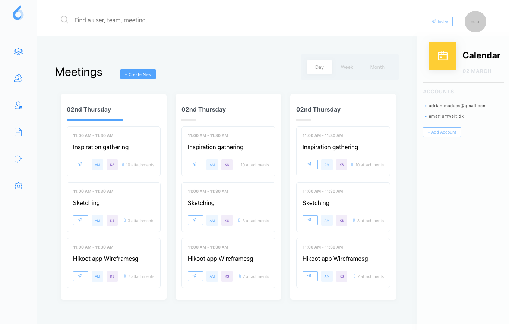

# ooto Productivity Dashboard

This project was a design sprint taking [a free Sketch resource on Uplabs](https://www.uplabs.com/posts/ooto-productivity-dashboards) and converting it to React UI components. Each component is styled using CSS in JS through Styled Components. The app is not actually meant to function, just to serve as a UI kit.

## Development

`npm run start`

Built on Create React App

## Progress

- [✅] Meetings Page
- [] Create Event Page
- [] Sessions Page

## Credits

- [ooto Productivity Dashboard on Uplabs](https://www.uplabs.com/posts/ooto-productivity-dashboards)
